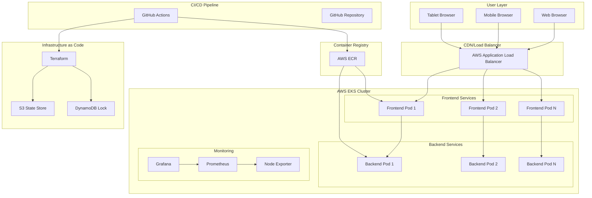
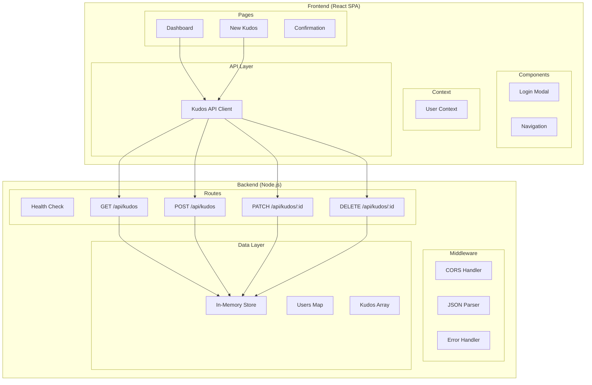
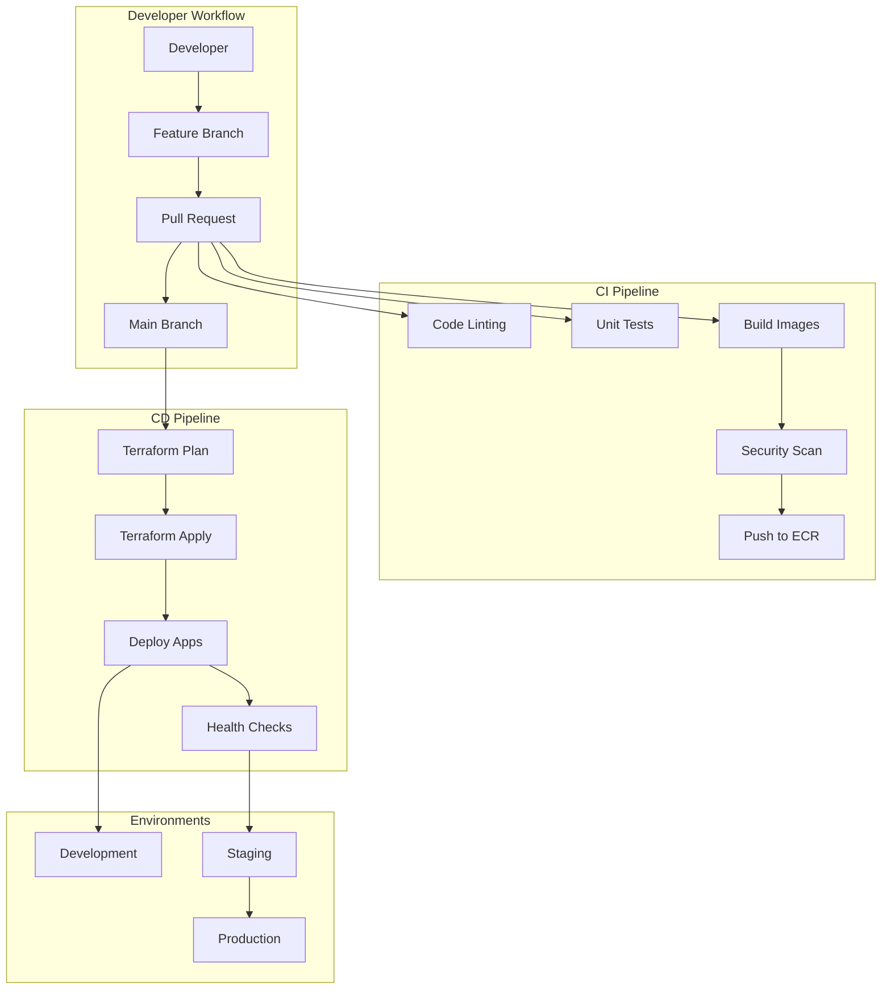
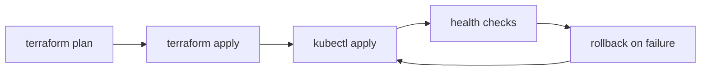
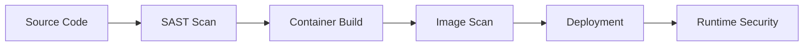
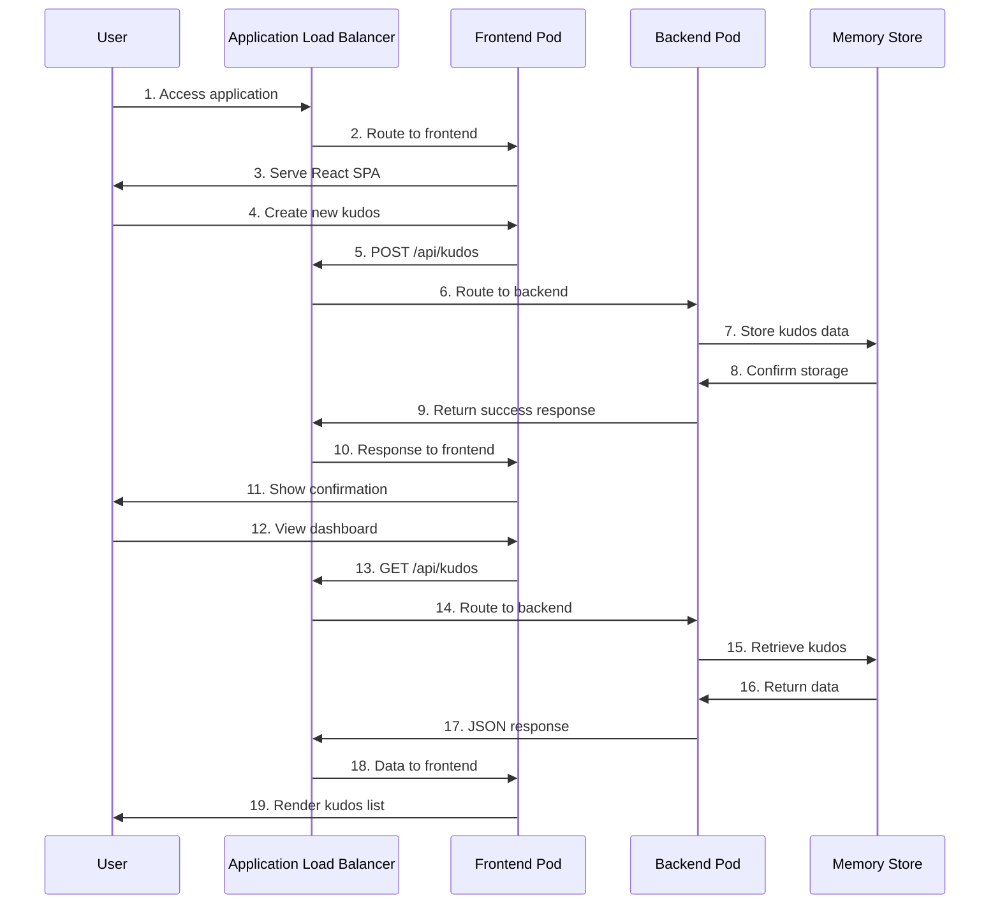
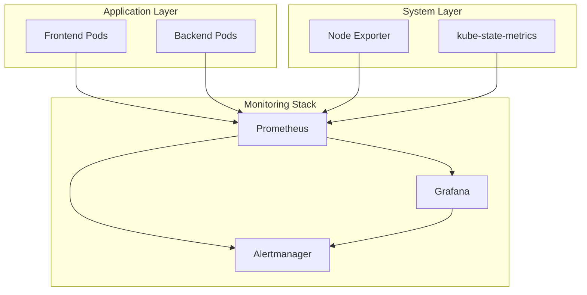

# 🏗️ Kudos App - Comprehensive Architecture Design

## 📋 Table of Contents
1. [Executive Summary](#executive-summary)
2. [Application Overview](#application-overview)
3. [Technical Stack](#technical-stack)
4. [High-Level Architecture](#high-level-architecture)
5. [Infrastructure Architecture](#infrastructure-architecture)
6. [Application Architecture](#application-architecture)
7. [Container Architecture](#container-architecture)
8. [Kubernetes Architecture](#kubernetes-architecture)
9. [Monitoring & Observability](#monitoring--observability)
10. [CI/CD Architecture](#cicd-architecture)
11. [Security Architecture](#security-architecture)
12. [Data Flow Diagrams](#data-flow-diagrams)
13. [Scalability Considerations](#scalability-considerations)
14. [Disaster Recovery](#disaster-recovery)
15. [Cost Optimization](#cost-optimization)

---

## Executive Summary

The Kudos App is a modern, cloud-native microservices application designed for recognizing team achievements. Built with React frontend and Node.js backend, it runs on AWS EKS with comprehensive monitoring, automated CI/CD, and enterprise-grade security.

### Key Architectural Principles
- **Cloud-Native**: Kubernetes-native deployment on AWS EKS
- **Microservices**: Decoupled frontend and backend services
- **GitOps**: Infrastructure and application deployment via GitHub Actions
- **Observable**: Comprehensive monitoring with Prometheus & Grafana
- **Secure**: RBAC, network policies, and container security scanning
- **Scalable**: Horizontal pod autoscaling and cluster autoscaling
- **Resilient**: Multi-AZ deployment with automated failover

---

## Application Overview

### Core Functionality
- **Kudos Management**: Create, view, and interact with peer recognition messages
- **User Management**: Automatic user creation with avatar generation
- **Social Features**: Like system for kudos messages
- **Real-time Updates**: Dynamic content refresh

### Business Logic
- In-memory data storage (development/demo)
- RESTful API design
- User session management
- Validation and sanitization

---

## Technical Stack

### Frontend Stack
```
┌─────────────────────────────────────────────────────────────┐
│                    Frontend (React SPA)                     │
├─────────────────────────────────────────────────────────────┤
│ • React 18.2.0         • React Router DOM 7.12.0          │
│ • Vite 5.4.0           • TailwindCSS 3.4.0                 │
│ • Vitest Testing       • Responsive Design                 │
│ • ES Modules           • Modern JavaScript                 │
└─────────────────────────────────────────────────────────────┘
```

### Backend Stack
```
┌─────────────────────────────────────────────────────────────┐
│                   Backend (Node.js API)                     │
├─────────────────────────────────────────────────────────────┤
│ • Node.js 18+          • Express.js 4.18.2                 │
│ • UUID Generation      • CORS Middleware                   │
│ • In-memory Storage    • RESTful API Design                │
│ • Health Checks        • Error Handling                    │
└─────────────────────────────────────────────────────────────┘
```

### Infrastructure Stack
```
┌─────────────────────────────────────────────────────────────┐
│                  Infrastructure (AWS)                       │
├─────────────────────────────────────────────────────────────┤
│ • EKS Cluster          • EC2 Worker Nodes                  │
│ • ECR Registry         • VPC with Multi-AZ                 │
│ • S3 State Store       • DynamoDB Locking                  │
│ • IAM Roles/Policies   • ALB Ingress                       │
└─────────────────────────────────────────────────────────────┘
```

---

## High-Level Architecture



---

## Infrastructure Architecture

### AWS EKS Cluster Architecture

```
┌─────────────────────────────────────────────────────────────────────────┐
│                              AWS Region (us-east-1)                      │
├─────────────────────────────────────────────────────────────────────────┤
│  ┌─────────────────────────────────────────────────────────────────┐    │
│  │                          VPC (10.0.0.0/16)                      │    │
│  │                                                                  │    │
│  │  ┌─────────────────┐  ┌─────────────────┐  ┌─────────────────┐  │    │
│  │  │  Public Subnet  │  │  Public Subnet  │  │  Public Subnet  │  │    │
│  │  │   (10.0.1.0/24) │  │   (10.0.2.0/24) │  │   (10.0.3.0/24) │  │    │
│  │  │      AZ-1a      │  │      AZ-1b      │  │      AZ-1c      │  │    │
│  │  │                 │  │                 │  │                 │  │    │
│  │  │ ┌─────────────┐ │  │ ┌─────────────┐ │  │ ┌─────────────┐ │  │    │
│  │  │ │   NAT GW    │ │  │ │   NAT GW    │ │  │ │   NAT GW    │ │  │    │
│  │  │ └─────────────┘ │  │ └─────────────┘ │  │ └─────────────┘ │  │    │
│  │  └─────────────────┘  └─────────────────┘  └─────────────────┘  │    │
│  │                                                                  │    │
│  │  ┌─────────────────┐  ┌─────────────────┐  ┌─────────────────┐  │    │
│  │  │ Private Subnet  │  │ Private Subnet  │  │ Private Subnet  │  │    │
│  │  │  (10.0.11.0/24) │  │  (10.0.12.0/24) │  │  (10.0.13.0/24) │  │    │
│  │  │      AZ-1a      │  │      AZ-1b      │  │      AZ-1c      │  │    │
│  │  │                 │  │                 │  │                 │  │    │
│  │  │ ┌─────────────┐ │  │ ┌─────────────┐ │  │ ┌─────────────┐ │  │    │
│  │  │ │ Worker Node │ │  │ │ Worker Node │ │  │ │ Worker Node │ │  │    │
│  │  │ │   (t3.medium)│ │  │ │   (t3.medium)│ │  │ │   (t3.medium)│ │  │    │
│  │  │ └─────────────┘ │  │ └─────────────┘ │  │ └─────────────┘ │  │    │
│  │  └─────────────────┘  └─────────────────┘  └─────────────────┘  │    │
│  │                                                                  │    │
│  │  ┌─────────────────────────────────────────────────────────────┐ │    │
│  │  │                    EKS Control Plane                        │ │    │
│  │  │              (AWS Managed Service)                         │ │    │
│  │  └─────────────────────────────────────────────────────────────┘ │    │
│  └─────────────────────────────────────────────────────────────────┘    │
│                                                                          │
│  ┌─────────────────┐  ┌─────────────────┐  ┌─────────────────────────┐  │
│  │       S3        │  │      ECR        │  │       DynamoDB          │  │
│  │  Terraform      │  │   Container     │  │    State Locking        │  │
│  │     State       │  │    Registry     │  │                         │  │
│  └─────────────────┘  └─────────────────┘  └─────────────────────────┘  │
└─────────────────────────────────────────────────────────────────────────┘
```

### Infrastructure Components

#### Compute Layer
- **EKS Cluster**: Managed Kubernetes control plane
  - Version: 1.29+
  - Multi-AZ control plane for HA
  - Integrated with AWS CloudTrail
  - RBAC enabled

- **Worker Nodes**: EC2 instances in private subnets
  - Instance Type: t3.medium (2 vCPU, 4GB RAM)
  - Auto Scaling Group: 1-5 nodes
  - EBS-optimized instances
  - Container runtime: containerd

#### Network Layer
- **VPC**: Dedicated virtual network (10.0.0.0/16)
- **Subnets**: 
  - Public: ALB and NAT Gateways (3 AZs)
  - Private: EKS worker nodes (3 AZs)
- **Internet Gateway**: Public internet access
- **NAT Gateways**: Outbound internet for private subnets
- **Route Tables**: Custom routing configuration

#### Storage Layer
- **EBS Volumes**: Persistent storage for pods
  - GP2 storage class
  - Dynamic provisioning
  - EBS CSI driver with IRSA
- **S3 Bucket**: Terraform state storage
  - Versioning enabled
  - Server-side encryption
- **DynamoDB**: Terraform state locking

---

## Application Architecture

### Component Diagram



### API Design

#### REST Endpoints

| Method | Endpoint | Purpose | Request | Response |
|--------|----------|---------|---------|----------|
| GET | `/health` | Health check | - | `{status, timestamp}` |
| GET | `/api/kudos` | List all kudos | - | `{success, data[], total}` |
| POST | `/api/kudos` | Create kudos | `{recipientName, message, giverName, giverAvatar?}` | `{success, data, message}` |
| PATCH | `/api/kudos/:id` | Update kudos | `{message?}` | `{success, data, message}` |
| DELETE | `/api/kudos/:id` | Delete kudos | - | `{success, message}` |

#### Data Models

```typescript
interface User {
  id: string;
  name: string;
  avatar: string;
  createdAt: string;
}

interface Kudos {
  id: string;
  recipientName: string;
  message: string;
  giver: User;
  createdAt: string;
  likes: number;
  likedBy: string[];
}

interface APIResponse<T> {
  success: boolean;
  data?: T;
  error?: string;
  message?: string;
}
```

---

## Container Architecture

### Multi-Stage Build Strategy

#### Frontend Container
```dockerfile
# Build Stage
FROM node:18-alpine AS build
WORKDIR /app
COPY package*.json ./
RUN npm ci --silent
COPY . .
ENV VITE_API_URL=""
RUN npm run build

# Runtime Stage
FROM nginx:stable-alpine
COPY --from=build /app/dist /usr/share/nginx/html
COPY nginx.conf /etc/nginx/conf.d/default.conf
EXPOSE 80
CMD ["nginx", "-g", "daemon off;"]
```

#### Backend Container
```dockerfile
FROM node:18-alpine
WORKDIR /app
COPY package*.json ./
RUN npm ci --only=production
COPY . .
EXPOSE 3001
USER node
CMD ["node", "server.js"]
```

### Container Security
- **Non-root user**: Applications run as non-privileged users
- **Minimal base images**: Alpine Linux for smaller attack surface
- **Multi-stage builds**: Separate build and runtime environments
- **Layer optimization**: Cached dependency installation
- **Security scanning**: Automated vulnerability scanning with Snyk

---

## Kubernetes Architecture

### Namespace Organization

```
┌─────────────────────────────────────────────────────────────────┐
│                        EKS Cluster                              │
├─────────────────────────────────────────────────────────────────┤
│                                                                 │
│  ┌─────────────────┐  ┌─────────────────┐  ┌─────────────────┐ │
│  │    default      │  │  kube-system    │  │   monitoring    │ │
│  │                 │  │                 │  │                 │ │
│  │ • Frontend      │  │ • CoreDNS       │  │ • Prometheus    │ │
│  │ • Backend       │  │ • AWS LB Ctrl   │  │ • Grafana       │ │
│  │ • ConfigMaps    │  │ • EBS CSI       │  │ • Node Exporter │ │
│  │ • Services      │  │ • Cluster Auto  │  │ • Alertmanager  │ │
│  │ • Ingress       │  │ • Metrics       │  │                 │ │
│  └─────────────────┘  └─────────────────┘  └─────────────────┘ │
└─────────────────────────────────────────────────────────────────┘
```

### Workload Configuration

#### Frontend Deployment
```yaml
apiVersion: apps/v1
kind: Deployment
metadata:
  name: kudos-frontend
spec:
  replicas: 2
  strategy:
    type: RollingUpdate
    rollingUpdate:
      maxUnavailable: 1
      maxSurge: 1
  template:
    spec:
      containers:
      - name: frontend
        image: ECR_REPO/frontend:latest
        ports:
        - containerPort: 80
        resources:
          requests:
            cpu: 50m
            memory: 64Mi
          limits:
            cpu: 200m
            memory: 256Mi
        livenessProbe:
          httpGet:
            path: /
            port: 80
          initialDelaySeconds: 30
          periodSeconds: 10
        readinessProbe:
          httpGet:
            path: /
            port: 80
          initialDelaySeconds: 5
          periodSeconds: 5
```

#### Backend Deployment
```yaml
apiVersion: apps/v1
kind: Deployment
metadata:
  name: kudos-backend
spec:
  replicas: 2
  template:
    spec:
      containers:
      - name: backend
        image: ECR_REPO/backend:latest
        ports:
        - containerPort: 3001
        env:
        - name: PORT
          value: "3001"
        resources:
          requests:
            cpu: 100m
            memory: 128Mi
          limits:
            cpu: 500m
            memory: 512Mi
        livenessProbe:
          httpGet:
            path: /health
            port: 3001
        readinessProbe:
          httpGet:
            path: /health
            port: 3001
```

#### Service Configuration
```yaml
# Frontend Service
apiVersion: v1
kind: Service
metadata:
  name: kudos-frontend-service
spec:
  selector:
    app: kudos-frontend
  ports:
  - port: 80
    targetPort: 80
  type: ClusterIP

---
# Backend Service
apiVersion: v1
kind: Service
metadata:
  name: kudos-backend-service
spec:
  selector:
    app: kudos-backend
  ports:
  - port: 3001
    targetPort: 3001
  type: ClusterIP
```

#### Ingress Configuration
```yaml
apiVersion: networking.k8s.io/v1
kind: Ingress
metadata:
  name: kudos-app-ingress
  annotations:
    kubernetes.io/ingress.class: alb
    alb.ingress.kubernetes.io/scheme: internet-facing
    alb.ingress.kubernetes.io/target-type: ip
spec:
  rules:
  - http:
      paths:
      - path: /
        pathType: Prefix
        backend:
          service:
            name: kudos-frontend-service
            port:
              number: 80
      - path: /api
        pathType: Prefix
        backend:
          service:
            name: kudos-backend-service
            port:
              number: 3001
```

### Auto-scaling Configuration

#### Horizontal Pod Autoscaler
```yaml
apiVersion: autoscaling/v2
kind: HorizontalPodAutoscaler
metadata:
  name: kudos-frontend-hpa
spec:
  scaleTargetRef:
    apiVersion: apps/v1
    kind: Deployment
    name: kudos-frontend
  minReplicas: 2
  maxReplicas: 10
  metrics:
  - type: Resource
    resource:
      name: cpu
      target:
        type: Utilization
        averageUtilization: 70
  - type: Resource
    resource:
      name: memory
      target:
        type: Utilization
        averageUtilization: 80
```

#### Cluster Autoscaler
```yaml
apiVersion: apps/v1
kind: Deployment
metadata:
  name: cluster-autoscaler
  namespace: kube-system
spec:
  template:
    spec:
      containers:
      - image: k8s.gcr.io/autoscaling/cluster-autoscaler:v1.29.0
        name: cluster-autoscaler
        command:
        - ./cluster-autoscaler
        - --v=4
        - --stderrthreshold=info
        - --cloud-provider=aws
        - --skip-nodes-with-local-storage=false
        - --expander=least-waste
        - --node-group-auto-discovery=asg:tag=k8s.io/cluster-autoscaler/enabled,k8s.io/cluster-autoscaler/kudos-cluster
```

---

## Monitoring & Observability

### Monitoring Stack Architecture

```
┌─────────────────────────────────────────────────────────────────┐
│                      Monitoring Architecture                    │
├─────────────────────────────────────────────────────────────────┤
│                                                                 │
│  ┌─────────────────────────────────────────────────────────┐   │
│  │                    Grafana                               │   │
│  │  ┌─────────────┐ ┌─────────────┐ ┌─────────────────────┐ │   │
│  │  │ Application │ │   Cluster   │ │      Resource       │ │   │
│  │  │ Dashboard   │ │ Dashboard   │ │    Dashboard        │ │   │
│  │  └─────────────┘ └─────────────┘ └─────────────────────┘ │   │
│  └─────────────────┬───────────────────────────────────────┘   │
│                    │                                           │
│  ┌─────────────────▼───────────────────────────────────────┐   │
│  │                 Prometheus                              │   │
│  │  ┌─────────────┐ ┌─────────────┐ ┌─────────────────────┐ │   │
│  │  │   Metrics   │ │    Rules    │ │       Alerts        │ │   │
│  │  │   Storage   │ │   Engine    │ │       Manager       │ │   │
│  │  └─────────────┘ └─────────────┘ └─────────────────────┘ │   │
│  └─────────────────┬───────────────────────────────────────┘   │
│                    │                                           │
│  ┌─────────────────▼───────────────────────────────────────┐   │
│  │                Data Sources                             │   │
│  │                                                         │   │
│  │ ┌─────────────┐ ┌─────────────┐ ┌─────────────────────┐ │   │
│  │ │    App      │ │    Node     │ │       kube-         │ │   │
│  │ │  Metrics    │ │   Exporter  │ │    state-metrics    │ │   │
│  │ │ (/metrics)  │ │             │ │                     │ │   │
│  │ └─────────────┘ └─────────────┘ └─────────────────────┘ │   │
│  └─────────────────────────────────────────────────────────┘   │
└─────────────────────────────────────────────────────────────────┘
```

### Metrics Collection

#### Application Metrics
- **Request Rate**: Requests per second by endpoint
- **Response Time**: P50, P95, P99 latencies
- **Error Rate**: 4xx/5xx error percentages
- **Custom Metrics**: Business KPIs (kudos created, users active)

#### Infrastructure Metrics
- **CPU Utilization**: Node and pod level
- **Memory Usage**: Available, used, cached
- **Disk I/O**: Read/write operations and throughput
- **Network**: Ingress/egress traffic and errors

#### Kubernetes Metrics
- **Pod Status**: Running, pending, failed pods
- **Deployments**: Replicas desired vs available
- **Services**: Endpoint availability
- **Cluster Events**: Scheduling, scaling events

### Dashboard Examples

#### Application Dashboard KPIs
```
┌─────────────────────────────────────────────────────────┐
│ Kudos App - Application Dashboard                       │
├─────────────────────────────────────────────────────────┤
│                                                         │
│ Total Requests: 1.2K/min   Error Rate: 0.1%           │
│ Avg Response: 45ms         P95 Response: 120ms         │
│                                                         │
│ Active Users: 23           Kudos Created: 156          │
│ Frontend Pods: 2/2         Backend Pods: 2/2           │
│                                                         │
│ [Request Rate Graph    ] [Response Time Graph     ]    │
│ [Error Rate Graph      ] [Resource Usage Graph    ]    │
│                                                         │
└─────────────────────────────────────────────────────────┘
```

### Alerting Rules

#### Critical Alerts
```yaml
groups:
- name: kudos-app-critical
  rules:
  - alert: HighErrorRate
    expr: rate(http_requests_total{status=~"5.."}[5m]) > 0.05
    for: 2m
    labels:
      severity: critical
    annotations:
      summary: High error rate detected
      
  - alert: HighResponseTime
    expr: histogram_quantile(0.95, rate(http_request_duration_seconds_bucket[5m])) > 1
    for: 5m
    labels:
      severity: warning
    annotations:
      summary: High response time detected
      
  - alert: PodCrashLooping
    expr: rate(kube_pod_container_status_restarts_total[10m]) > 0
    for: 1m
    labels:
      severity: critical
    annotations:
      summary: Pod is crash looping
```

---

## CI/CD Architecture

### GitHub Actions Workflow



### Workflow Configuration

#### Build & Test Workflow
```yaml
name: Build and Test
on:
  pull_request:
    branches: [main]
  push:
    branches: [main]

jobs:
  test:
    runs-on: ubuntu-latest
    steps:
    - uses: actions/checkout@v4
    - name: Setup Node.js
      uses: actions/setup-node@v4
      with:
        node-version: '18'
        cache: 'npm'
        
    - name: Install dependencies
      run: |
        npm ci
        cd server && npm ci
        
    - name: Run tests
      run: |
        npm run test:ci
        cd server && npm test
        
    - name: Build application
      run: npm run build

  security:
    runs-on: ubuntu-latest
    steps:
    - uses: actions/checkout@v4
    - name: Run Snyk security scan
      uses: snyk/actions/node@master
      env:
        SNYK_TOKEN: ${{ secrets.SNYK_TOKEN }}
```

#### Deployment Workflow
```yaml
name: Deploy to EKS
on:
  push:
    branches: [main]
  workflow_dispatch:
    inputs:
      environment:
        description: 'Environment to deploy'
        required: true
        default: 'dev'
        type: choice
        options:
        - dev
        - staging
        - prod

jobs:
  build-and-push:
    runs-on: ubuntu-latest
    steps:
    - name: Configure AWS credentials
      uses: aws-actions/configure-aws-credentials@v4
      with:
        aws-access-key-id: ${{ secrets.AWS_ACCESS_KEY_ID }}
        aws-secret-access-key: ${{ secrets.AWS_SECRET_ACCESS_KEY }}
        aws-region: us-east-1
        
    - name: Login to ECR
      uses: aws-actions/amazon-ecr-login@v2
      
    - name: Build and push images
      run: |
        docker build -t $ECR_REGISTRY/frontend:$GITHUB_SHA .
        docker build -t $ECR_REGISTRY/backend:$GITHUB_SHA -f Dockerfile.backend .
        docker push $ECR_REGISTRY/frontend:$GITHUB_SHA
        docker push $ECR_REGISTRY/backend:$GITHUB_SHA

  deploy:
    needs: build-and-push
    runs-on: ubuntu-latest
    environment: ${{ inputs.environment || 'dev' }}
    steps:
    - name: Deploy to EKS
      run: |
        kubectl set image deployment/kudos-frontend frontend=$ECR_REGISTRY/frontend:$GITHUB_SHA
        kubectl set image deployment/kudos-backend backend=$ECR_REGISTRY/backend:$GITHUB_SHA
        kubectl rollout status deployment/kudos-frontend
        kubectl rollout status deployment/kudos-backend
```

### Infrastructure as Code

#### Terraform State Management
```hcl
terraform {
  backend "s3" {
    bucket         = "terraform-state-kudos-app"
    key            = "eks-cluster/terraform.tfstate"
    region         = "us-east-1"
    encrypt        = true
    dynamodb_table = "terraform-locks"
  }
}
```

#### Resource Lifecycle


---

## Security Architecture

### Defense in Depth Strategy

```
┌─────────────────────────────────────────────────────────────────┐
│                        Security Layers                          │
├─────────────────────────────────────────────────────────────────┤
│                                                                 │
│ ┌─────────────────────────────────────────────────────────────┐ │
│ │                    Application Security                     │ │
│ │ • Input Validation    • Error Handling                     │ │
│ │ • CORS Configuration  • Security Headers                   │ │
│ └─────────────────────────────────────────────────────────────┘ │
│                                                                 │
│ ┌─────────────────────────────────────────────────────────────┐ │
│ │                   Container Security                        │ │
│ │ • Non-root Users      • Minimal Base Images                │ │
│ │ • Security Scanning   • Image Signing                      │ │
│ └─────────────────────────────────────────────────────────────┘ │
│                                                                 │
│ ┌─────────────────────────────────────────────────────────────┐ │
│ │                  Kubernetes Security                        │ │
│ │ • RBAC Policies       • Network Policies                   │ │
│ │ • Pod Security        • Service Mesh                       │ │
│ └─────────────────────────────────────────────────────────────┘ │
│                                                                 │
│ ┌─────────────────────────────────────────────────────────────┐ │
│ │                   Network Security                          │ │
│ │ • VPC Isolation       • Security Groups                    │ │
│ │ • NACLs              • Private Subnets                     │ │
│ └─────────────────────────────────────────────────────────────┘ │
│                                                                 │
│ ┌─────────────────────────────────────────────────────────────┐ │
│ │                  Infrastructure Security                    │ │
│ │ • IAM Roles/Policies  • Encryption at Rest                 │ │
│ │ • CloudTrail Logging  • Config Rules                       │ │
│ └─────────────────────────────────────────────────────────────┘ │
└─────────────────────────────────────────────────────────────────┘
```

### RBAC Configuration

#### Service Accounts
```yaml
apiVersion: v1
kind: ServiceAccount
metadata:
  name: kudos-app-sa
  annotations:
    eks.amazonaws.com/role-arn: arn:aws:iam::ACCOUNT:role/KudosAppRole
---
apiVersion: rbac.authorization.k8s.io/v1
kind: ClusterRole
metadata:
  name: kudos-app-role
rules:
- apiGroups: [""]
  resources: ["pods", "services", "configmaps"]
  verbs: ["get", "list", "watch"]
```

### Network Policies
```yaml
apiVersion: networking.k8s.io/v1
kind: NetworkPolicy
metadata:
  name: kudos-app-netpol
spec:
  podSelector:
    matchLabels:
      app: kudos-frontend
  policyTypes:
  - Ingress
  - Egress
  ingress:
  - from:
    - namespaceSelector:
        matchLabels:
          name: ingress-nginx
    ports:
    - protocol: TCP
      port: 80
  egress:
  - to:
    - podSelector:
        matchLabels:
          app: kudos-backend
    ports:
    - protocol: TCP
      port: 3001
```

### Security Scanning Pipeline



---

## Data Flow Diagrams

### User Journey Data Flow



### Request Flow Architecture

```
Internet → ALB → Ingress Controller → Frontend Service → Frontend Pod
                                   ↓
                                API Requests
                                   ↓
                      Backend Service → Backend Pod → Memory Store
```

### Monitoring Data Flow



---

## Scalability Considerations

### Horizontal Scaling Strategy

#### Application Scaling
```
Current:  2 Frontend Pods ←→ 2 Backend Pods
Scale Up: 10 Frontend Pods ←→ 5 Backend Pods (Under Load)
Metrics:  CPU > 70% OR Memory > 80% OR Custom Metrics
```

#### Infrastructure Scaling
```
Worker Nodes: 1-5 EC2 instances (Auto Scaling Group)
Trigger: Pod resource pressure, unschedulable pods
Instance Types: t3.medium → c5.large (performance tiers)
```

### Vertical Scaling
```yaml
# Resource requests and limits progression
Development:
  requests: {cpu: 50m, memory: 64Mi}
  limits:   {cpu: 200m, memory: 256Mi}

Production:
  requests: {cpu: 200m, memory: 256Mi}
  limits:   {cpu: 1000m, memory: 1Gi}
```

### Performance Optimization

#### Frontend Optimization
- **Code Splitting**: Dynamic imports for route-based chunks
- **Lazy Loading**: Components loaded on demand
- **Bundle Analysis**: Webpack bundle analyzer integration
- **CDN Integration**: Static asset distribution (future)

#### Backend Optimization
- **Connection Pooling**: Database connection management (future)
- **Caching Layer**: Redis/ElastiCache integration (future)
- **API Rate Limiting**: Request throttling (future)
- **Response Compression**: gzip/brotli compression

#### Infrastructure Optimization
- **Cluster Autoscaler**: Automatic node provisioning
- **Vertical Pod Autoscaler**: Resource right-sizing
- **KEDA**: Event-driven autoscaling (future)
- **Spot Instances**: Cost-optimized scaling (future)

---

## Disaster Recovery

### Backup Strategy

#### Application Data
```
Current: In-memory storage (non-persistent)
Future:  Database backups, persistent volume snapshots
```

#### Infrastructure State
```
Terraform State: S3 with versioning + cross-region replication
Git Repository: GitHub with backup repositories
Container Images: ECR with lifecycle policies
```

### Recovery Procedures

#### RTO/RPO Targets
- **RTO (Recovery Time Objective)**: < 30 minutes
- **RPO (Recovery Point Objective)**: < 5 minutes
- **Availability Target**: 99.9% uptime

#### Disaster Scenarios

1. **Pod Failure**
   - Detection: Health checks fail
   - Recovery: Kubernetes automatic restart
   - Time: < 30 seconds

2. **Node Failure**
   - Detection: Node becomes NotReady
   - Recovery: Pods rescheduled to healthy nodes
   - Time: < 2 minutes

3. **Availability Zone Failure**
   - Detection: Multiple node failures
   - Recovery: Cluster Autoscaler provisions nodes in other AZs
   - Time: < 5 minutes

4. **Region Failure**
   - Detection: Manual/monitoring alerts
   - Recovery: Manual deployment to backup region
   - Time: < 30 minutes (manual process)

### High Availability Architecture

```
┌─────────────────────────────────────────────────────────────────┐
│                         Multi-AZ Setup                          │
├─────────────────────────────────────────────────────────────────┤
│                                                                 │
│  AZ-1a              AZ-1b              AZ-1c                    │
│  ┌─────────────┐    ┌─────────────┐    ┌─────────────┐         │
│  │ Frontend 1  │    │ Frontend 2  │    │ Frontend 3  │         │
│  │ Backend 1   │    │ Backend 2   │    │ Backend 3   │         │
│  │ Worker Node │    │ Worker Node │    │ Worker Node │         │
│  └─────────────┘    └─────────────┘    └─────────────┘         │
│                                                                 │
│  Load Balancer spans all AZs                                   │
│  EKS Control Plane managed across multiple AZs                 │
└─────────────────────────────────────────────────────────────────┘
```

---

## Cost Optimization

### Resource Optimization

#### Current Cost Structure (Estimated Monthly)
```
EKS Control Plane:    $73  (24/7)
EC2 Worker Nodes:     $45  (3x t3.medium)
ALB:                  $18  (1 ALB + LCU)
ECR Storage:          $5   (Container images)
S3 & DynamoDB:        $5   (Terraform state)
Monitoring:           $10  (CloudWatch, Grafana)
Total:                ~$156/month
```

#### Optimization Strategies

1. **Right-sizing**
   ```yaml
   # Current oversized for demo
   Current: t3.medium (2 vCPU, 4GB)
   Optimized: t3.small (2 vCPU, 2GB) or t3.micro (2 vCPU, 1GB)
   Savings: ~30%
   ```

2. **Spot Instances**
   ```yaml
   Mixed Instance Types:
   - On-Demand: 20% (critical workloads)
   - Spot: 80% (cost savings up to 90%)
   ```

3. **Resource Limits**
   ```yaml
   # Prevent resource waste
   resources:
     limits:
       cpu: 200m      # Prevent CPU spike costs
       memory: 256Mi  # Prevent memory overallocation
   ```

4. **Cluster Autoscaling**
   ```yaml
   # Scale to zero during off-hours (if applicable)
   minSize: 1    # Keep minimum infrastructure
   maxSize: 5    # Limit maximum spend
   ```

### Cost Monitoring

#### Budget Alerts
```yaml
AWS Budgets:
- Name: EKS-Monthly-Budget
- Amount: $200/month
- Alerts: 80%, 100%, forecast 120%
- Actions: SNS notifications, auto-scaling restrictions
```

#### Cost Allocation Tags
```yaml
Tags:
  Project: kudos-app
  Environment: dev/staging/prod
  Owner: team-platform
  CostCenter: engineering
```

---

## Future Enhancements

### Short-term Roadmap (3-6 months)

1. **Persistent Storage**
   - Replace in-memory storage with PostgreSQL/RDS
   - Implement data persistence and backup strategies
   - Add database migration capabilities

2. **Authentication & Authorization**
   - Integrate with OAuth providers (Google, GitHub)
   - Implement JWT-based session management
   - Add role-based access control

3. **Performance Optimization**
   - Add Redis caching layer
   - Implement CDN for static assets
   - Add API rate limiting

### Medium-term Roadmap (6-12 months)

1. **Multi-region Deployment**
   - Cross-region disaster recovery
   - Global load balancing
   - Data replication strategies

2. **Advanced Monitoring**
   - Distributed tracing with Jaeger
   - Custom business metrics dashboards
   - Automated anomaly detection

3. **Security Enhancements**
   - Service mesh implementation (Istio)
   - Enhanced network policies
   - Secrets management with AWS Secrets Manager

### Long-term Roadmap (12+ months)

1. **Microservices Evolution**
   - Break down monolithic backend
   - Implement event-driven architecture
   - Add message queues (SQS/SNS)

2. **AI/ML Integration**
   - Sentiment analysis for kudos messages
   - Personalized recommendations
   - Analytics and insights dashboard

3. **Mobile Application**
   - React Native mobile app
   - Push notifications
   - Offline-first architecture

---

## Conclusion

This architecture design provides a comprehensive foundation for the Kudos App, balancing simplicity with enterprise-grade practices. The cloud-native approach ensures scalability, reliability, and maintainability while keeping costs optimized for a development/demo application.

### Key Architectural Strengths

1. **Cloud-Native**: Built for Kubernetes with container-first approach
2. **Scalable**: Auto-scaling at application and infrastructure levels
3. **Observable**: Comprehensive monitoring and alerting
4. **Secure**: Defense-in-depth security strategy
5. **Automated**: GitOps-based CI/CD pipeline
6. **Cost-Effective**: Right-sized resources with optimization strategies

### Success Metrics

- **Availability**: 99.9% uptime SLA
- **Performance**: < 200ms API response times
- **Scalability**: Support 1000+ concurrent users
- **Recovery**: < 30 minute RTO, < 5 minute RPO
- **Cost**: < $200/month operational costs
- **Security**: Zero critical vulnerabilities

This architecture provides a solid foundation for current needs while maintaining flexibility for future growth and enhancement.